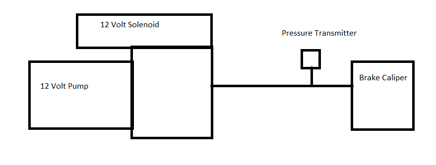
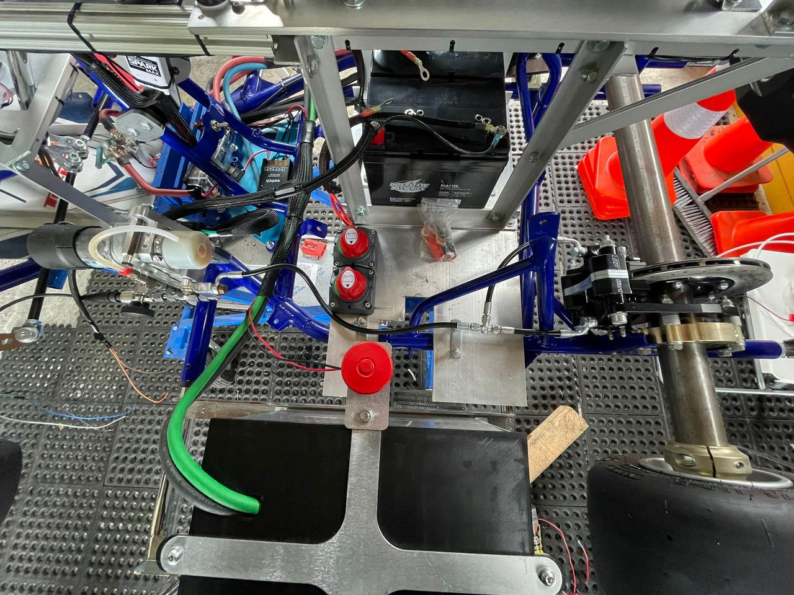
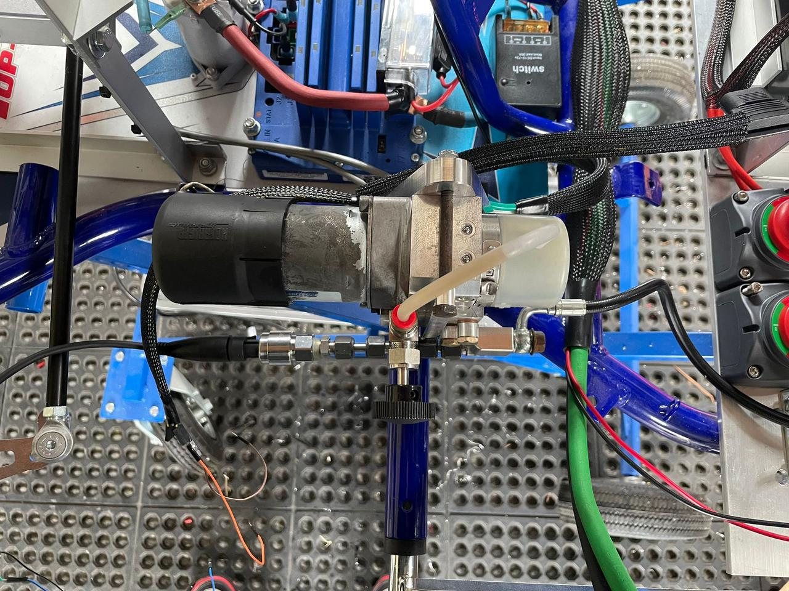
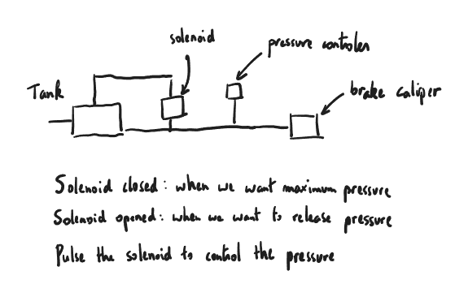

#### Documentation for the new braking system

#### Details
Our proposed solution is to utilize an actual brake hydrolic from a vehicle

https://www.ebay.com/p/1223764184?iid=354571938485

We hope that devices like this will have quicker response time. This unit combines a 12 volt  direct drive hydrolic pump, a fluid reservoir tank and a 12 volt reversing soleinoid. This unit combined with a pressure transmitter gives us the ability to control the brake pressure with a PID algorithm.   

#### Tools and Materials:

Before you begin the installation process, gather the following tools and materials:
1. Brake system kit (rotors, calipers, pads)
2. Battery
3. Hydraulic pump
4. Pressure Sensor
5. T-Pipe connectors
6. Screwdrivers
7. Lug wrench
8. Torque wrench
9. Brake tubing and fittings
10. Arduino
11. Potentiometer

#### Installation Steps:

##### 1. Connect the hydraulic pump to the brake's hydraulic system

##### 2. Insert the pressure sensor into the hydraulic circuit so that it can measure the pressure in the system

###### 3. The principle of the braking system is as follows:

The hydraulic pump pressurizes the fluid, moving it towards the brake system. To control the pressure, a solenoid built into the hydraulic pump acts like a valve, and can be opened to release pressure or closed to increase the pressure applied to the brake. So, to control the pressure within the brake, the aim is to create a control algorithm that can open or close the solenoid very quickly to control the pressure according to the desired pressure. The pressure sensor measures the pressure and adjusts it to the desired level.

##### 4. Arduino Code
This Arduino code is for controlling the hydraulic pump's solenoid based on input from a pressure sensor using a PID (Proportional-Integral-Derivative) controller. Let's break it down into simpler terms:

1. Libraries: The code uses three libraries: PID_v1.h for PID control, Wire.h for I2C communication, and Servo.h for controlling the servo motor.
2. Setup: In the setup function, it initializes serial communication for debugging, attaches the servo motor to pin 13, sets the sample time for the PID controller to 10 milliseconds, and enables the PID controller.
3. Loop: In the loop function, it continuously performs the following steps:

   a. Read Inputs: Reads the pressure sensor input and the setpoint from a potentiometer (a variable resistor).

   b. Pressure Mapping: Maps the pressure sensor input to a pressure range and prints the pressure value.

   c. PID Computation: Computes the PID control output based on the difference between the setpoint and the actual pressure.
   
   d. Servo Control: Maps the PID output to servo positions and moves the servo motor accordingly.

By adjusting the PID parameters (proportional, integral, and derivative gains) and the pressure mapping, you can control the servo motor to maintain a desired pressure setpoint. 

## Brake actuator
We use a [Kartech 12/24V linear actuator](https://kar-tech.com/12-24v-linear-actuator.html)

## Brake Pad
This is a hydraulic brake pad from OEM.

## Brake Linkage
