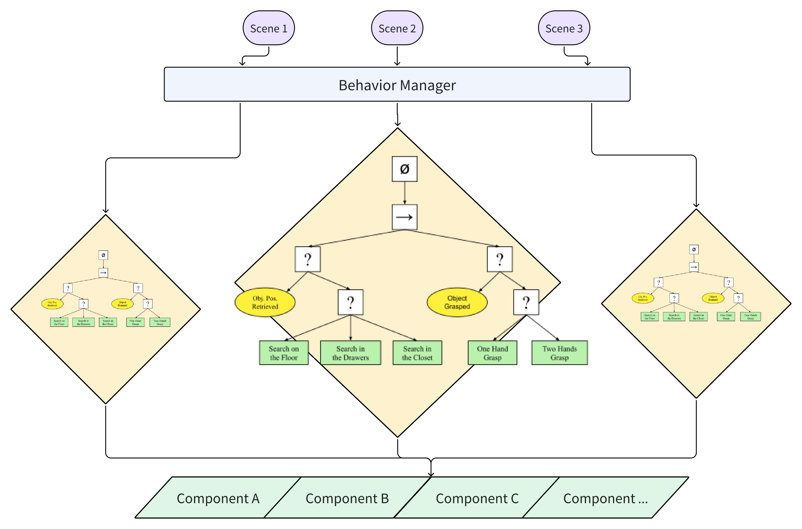

#### Summary
Behavior planning is a crucial component of autonomous systems.  It involves the process of determining the sequence of actions or behaviors that an autonomous agent or vehicle should undertake to achieve a specific goal or navigate its environment safely. Behavior planning typically occurs after perception and sensor data processing and before low-level control and execution of actions

#### Design Requirements
- Framework should be business logic agonistic
  - This module shall consist of common infrastructure for a variety of application. 
  - It will trigger different behavior based on the given scenario configuration
- Real time
  - \>= 30 hz
- Interaction with ControllerManager
  - Setting high level parameter to influence controls
- Interaction with Global Path Planner
  - Different strategies based on different scenarios and real world observations to select different next waypoint to achieve optimal control

#### Design

#### Inputs / Outputs / API
- Input
  - Scenario configuration file
  - Example: https://gitlab.com/roar-gokart/core/-/blob/develop/src/planning/behavior_planning/param/racing_behavior.xml?ref_type=heads
- Output
  - roar_msgs/BehaviorStatus.msg
    - https://gitlab.com/roar-gokart/core/-/blob/develop/src/roar_msgs/msg/BehaviorStatus.msg?ref_type=heads

#### Inner-workings / Algorithms
See https://www.behaviortree.dev/

#### References / External links
https://www.behaviortree.dev/

#### Future extensions / Unimplemented parts
- More scenario based behavior tree will be implemented for racing, parking, and different scenarios. 

#### See also

[Behavior Planning Lark documentation](https://n36411s2sqp.larksuite.com/wiki/wikusIvAeNK4KBNZPES7DSKhAsg)

[Behavior Planning Tree Lark documentation](https://n36411s2sqp.larksuite.com/wiki/AFeDwUqV9iQDdTkAjPYugvo6slf
)