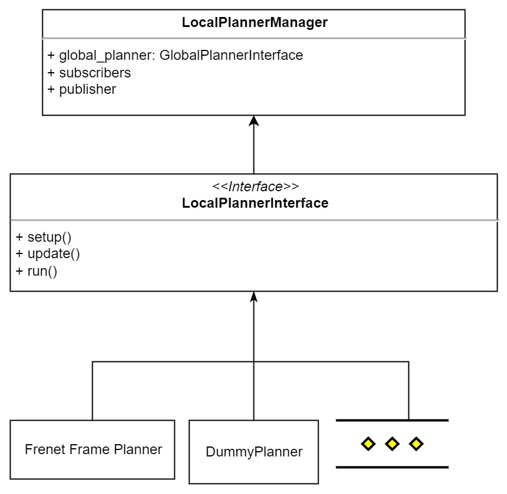
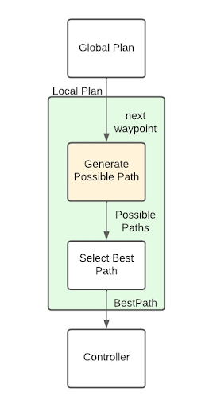
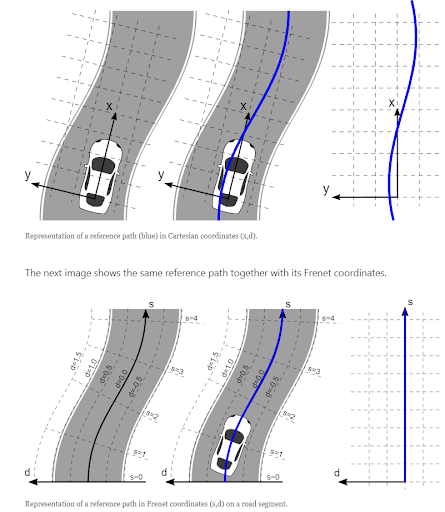

Unlike global planning which generates waypoints for reacing its desination, local planning involves determining the optimal path for the autonomous vehicle to get from one waypoint to another. 

#### Frenet Frame

 
We use frenet coordinates as shown in the picture, which are relative to the car instead of the global map. Using the target location generated by the global plan, we find the next waypoint, convert to  the local frame, generate beizure curves, and choose an optimal path.
- Select Best Path: To choose the best possible path, we calculate a cost based on the distance that we need to travel to get to the new place and whether there is a dangerous object there. The higher the distance needed to travel, the higher the cost. If there is an object greater than the threshold, we add to the cost. The path with the lowest cost is what the car goes with.

See also

[Local Planning Lark documentation](https://n36411s2sqp.larksuite.com/wiki/wikusP0Kp6IOebMdcUSXzxjhGuh)

[A* Local Planner documentation](https://n36411s2sqp.larksuite.com/wiki/TJ4LwMFaCiRU59kBil2uf4rzsEh)

[Optimize Local Planning documentation](https://n36411s2sqp.larksuite.com/wiki/MeEcwPFGjicz0Nkvx8Huhfxrs3e)

[Local Planner <> Controller Interaction](https://n36411s2sqp.larksuite.com/wiki/wikus2Sqe5GdQ9Re1d8kB5I7lzb)

